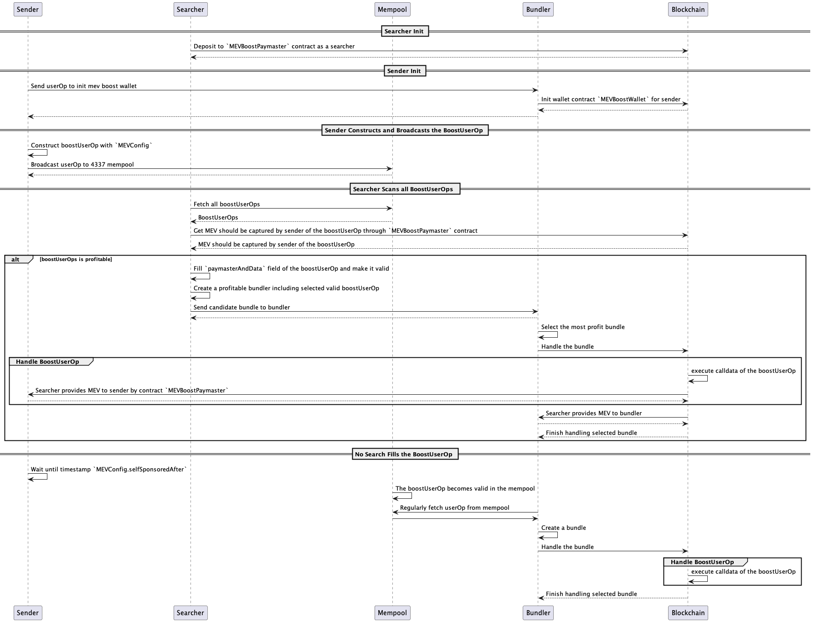

# MEVBoostAA

Only validators and searchers benefit from current MEV ecosystem while the transaction senders where MEV is actually extracted from are excluded.

In fact, senders need to pay twice for the transaction execution: the transaction fee and the fetched MEV. The latter always goes against the intention of the sender and can be consider as a robbery in secret towards sender.

The project supports senders to capture MEV under the ERC-4337 framework:

- Senders use special ERC-4337 wallets called `MEVBoostAccount` and send special userOps called `BoostUserOp` which invokes boost methods of `MEVBoostAccount`.
- Searchers use a special ERC-4337 paymaster called `MEVBoostPaymaster` which refunds maxium MEV to senders by `BoostUserOp` auction and also pays transaction fee for `BoostUserOp`.

The project mainly has following advantages:

- Improve the current MEV ecosystem and maximize the sender's interests by trustlessly ensuring the maxium MEV capture by the sender.
- It provides a completely **decentralized** and **permisionless** MEV-Share solution.
- Considering the existence of MEV, the project promotes the adoption of the ERC-4337 wallet by providing the build-in mev capture features and making transaction cost possibly less expensive than the EOA.

## Weekly Update
This project has released [weekly updates](https://mirror.xyz/0x07e5B116F4cc8739bc6e4BCc150E2E82b9cEBd19) since 2023.05.22.

## Value Redirection

### Current MEV Ecosystem

- In the view of the sender
  - `sender` --[fee to excute tx]--> `validator`
- The fact goes against the intention of the sender
  - `sender` --[fee to excute tx]--> `validator`
  - `sender` --[mev caputured by searcher]--> `searcher`
  - `searcher` --[share mev with validator]--> `validator`

### MEV Ecosystem with MEVBoostAA

MEVBoostAA captures MEV from searchers to senders based on the framework of ERC-4337. so, senders will be protected.

- `sender` --[mev caputured by searcher]--> `searcher`
- **`searcher` (as a paymaster) --[fee to excute tx] --> `validator`**
- **`searcher` --[maxium MEV refund]--> `sender`**
- `searcher` -- share mev with validator --> `validator`

## SDK
- [sdk for account](https://github.com/doublespending/mev-boost-aa-account-sdk)
- [sdk for searcher](https://github.com/doublespending/mev-boost-aa-searcher-sdk)

## Work Flow



The sender just need to depoly a ERC-4337 wallet `MEVBoostAccount`, construct a `BoostUserOp` (i.e. a userOp calling the `boostExecute` or `boostExecuteBatch` method) and broadcast it to the ERC-4337 mempool.

The first parameter of the method `boostExecute` or `boostExecuteBatch` is `MEVConfig` which including `minAmount`(i.e. minium required mev amount) and `selfSponsoredAfter`(i.e. timestamp after which the `BoostUserOp` is executed without `searcher` and `MEVBoostPaymaster`).

Searchers who have deposited fund to `MEVBoostPaymaster` will grab `BoostUserOps` in the ERC-4337 mempool.

- If the `BoostUserOp` is profitable, the searcher will fill `paymasterAndData` to make `BoostUserOp` valid, build a profitable ERC-4337 bundle including that `BoostUserOp` and send it to the bundler. Finally, if `BoostUserOp` is success, the sender will get `minAmount` MEV value from searcher and the `BoostUserOp` is sponsored by the searcher.

- If the `BoostUserOp` is not profitable, the searcher will not fill `paymasterAndData` of the `BoostUserOp`. That `BoostUserOp` in the ERC-4337 mempool will be valid after timestamp `selfSponsoredAfter`. The bundler will regularly bundle and execute that `BoostUserOp`.

Briefly, a `BoostUserOp` is valid when one of the following conditions is met:

- The searcher fills the `paymasterAndData`, pays `minAmount` MEV value to the sender and sponsors that `BoostUserOp`.
- The `BoostUserOp` is valid after timestamp `selfSponsoredAfter` and sponsored by the sender.

## Prerequisite

- node (>=16.0.0 <18)
- yarn (^1.22.10)
- foundry
- Environment Variables (Used for foundry fork tests)
  - MAINNET_NODE_RPC_URL: The RPC URL for accessing forked states.

### Example

```
  MAINNET_NODE_RPC_URL=https://eth-mainnet.alchemyapi.io/v2/#####__YOUR_SECRET__#####
```

## Installation

```
$ git submodule update --init --recursive
$ yarn run setup
```

## Compile contracts

```
$ yarn run compile # compile contracts
```

## Run unit test

```
$ yarn run test-foundry-fork # run unit tests with forked states
```
